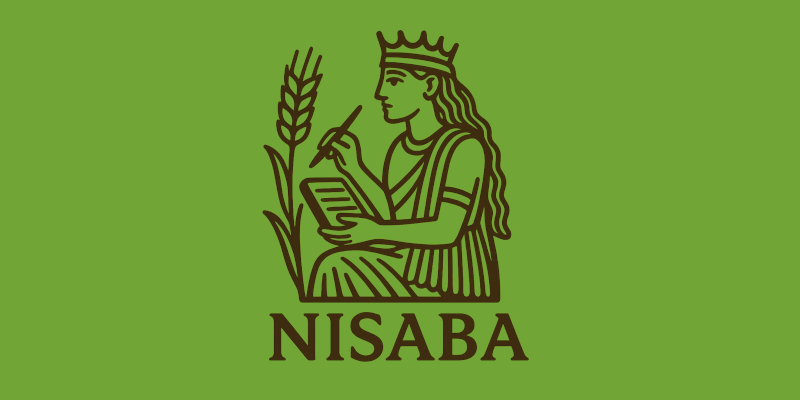

# Lector de Feeds para el siglo XXI

Con la ayuda de IA de última generación Nisaba te ayudará a **leer las noticias de una manera diferente**, asistido por un analista profesional. Carga fuentes de todo el mundo, actualízalas y pulsa el botón de «Análisis»., Obtendrás una selección de las noticias que realmente importan: las que muestran innovaciones disruptivas, cambios emergentes que pueden consolidarse en el futuro o nuevas perspectivas de ver las cosas. Todo  lo que potencialmente podría dar forma a los futuros que vienen.

Configurado por defecto para analizar la situación global, Nisaba puede personalizarse fácilmente para cualquier sector, actividad o tema de tu interés.

## ¿Cómo usar Nisaba para descubrir sus posibilidades?

1. Tras configurar la app, sube  feeds (fuentes RSS o Atom) de periodicos y revistas de todo el mundo, no te preocupes por el idioma y ponlas en una misma carpeta, llámala por ejemplo «Noticias».
2. Actualiza las feeds pulsando el botón de arriba a la izquierda. Si has puesto muchas puede tardar un rato en bajarlas todas.
3. Pulsa el botón «Análisis. Te aparecerá, por cada carpeta de fuentes que hayas añadido, un informe de análisis como los que elaboran los principales *think tanks* del mundo. Cada uno tiene un botón en la esquina superior derecha para que lo copies y lo guardes como quieras.
4. Lee las noticias. Nisaba se integra con la función de traducción de tu navegador.
   - Al ver una lista de noticias en varios idiomas, el navegador debería detectar el contenido mixto y ofrecerte traducirlo.
   - Al abrir un artículo en otro idioma, el navegador debería ofrecerte la traducción automáticamente.
   - **Si la ventana emergente de traducción no aparece** o la cierras por error, simplemente haz clic con el **botón derecho del ratón** en cualquier parte de la página y selecciona **"Traducir al español"** (o tu idioma).
   - *Consejo para Chrome/Edge*: Si el navegador se equivoca de idioma (ej. dice "inglés" pero hay varios), en la misma ventana emergente de traducción, haz clic en los tres puntos, elige "Elegir otro idioma" y selecciona "Idioma detectado" en el menú desplegable superior.

## Funcionalidades Principales

- **Agregación de Feeds**: Compatible con los formatos RSS y Atom.
- **Organización**: Agrupa tus feeds en carpetas temáticas para una mejor organización.
- **Importación/Exportación OPML**: Migra fácilmente tus suscripciones desde o hacia otros lectores de feeds.
- **Gestión de Artículos**: Marca artículos como leídos de forma individual o masiva.
- **Buscador Integrado**: Un potente buscador que te permite encontrar artículos en toda tu caché buscando por palabras clave en títulos y contenido. Los resultados incluyen artículos leídos (marcados visualmente) para que no pierdas ninguna información.
- **Caché Configurable**: Elige si los artículos leídos se ocultan inmediatamente o si permanecen visibles (en gris) durante 24 o 48 horas antes de ser eliminados de la caché.
- **Traducción Integrada con el Navegador**: En lugar de usar una API externa, Nisaba le indica a tu navegador el idioma del contenido para que puedas usar su función de traducción nativa, instantánea y gratuita.
- **Análisis con IA**: Utiliza la API de Google Gemini para generar análisis estratégicos y encontrar elementos  disruptivos y cambios de tendencias en tus artículos no leídos, agrupados por carpeta.
- **Notas Personales**: Toma notas sobre cualquier artículo o resumen. Tus notas se guardan y son accesibles en cualquier momento.
- **Enviar tus notas a Telegram**: Puedes compartir tus notas y los enlaces que comentan en un grupo o canal de Telegram con tan sólo pulsar un botón.
- **Recibir Notas**: Puedes suscribirte a las notas de otros usuarios para leer y analizar en equipo.
- **Feed de Notas**: Todas tus notas están disponibles a través de un feed RSS propio (`notas.xml`), permitiéndote que otros se suscriban a tus ideas y comentarios.
- **Feed de Análisis**: Todos los informes generados por la IA están disponibles en un nuevo feed RSS (`analisis.xml`). Esto te permite suscribirte a tus propios análisis desde otro lector de feeds o compartir tus hallazgos fácilmente.
- **Interfaz Sencilla**: Una interfaz de usuario limpia y adaptable, centrada en la legibilidad.

## Instalación y Configuración

Sigue estos pasos para instalar y configurar Nisaba en tu propio servidor.

### 1. Requisitos Previos

Antes de empezar, asegúrate de que tu servidor cumple con los siguientes requisitos:

- **Servidor Web**: Un servidor web como Apache o Nginx con soporte para PHP 8.0 o superior.
- **Extensiones de PHP**:
    - `curl`: Necesaria para la traducción automática y para comunicarse con la API de Gemini.
    - `dom`: Para procesar los feeds RSS/Atom.
    - `simplexml`: El motor principal para leer y escribir los archivos de datos.
    - `mbstring`: Para el manejo correcto de caracteres multibyte.
- **Permisos de Escritura**: El servidor web debe tener permisos para escribir en el directorio `data/` de Nisaba.

### 2. Instalación

1.  **Descarga Nisaba**:
    - **Opción A (Git)**: Clona el repositorio en tu servidor. Ve al directorio donde quieres instalar Nisaba y ejecuta:
      ```sh
      git clone https://github.com/ciamaximalista/nisaba.git
      ```
    - **Opción B (ZIP)**: Descarga el archivo ZIP desde el [repositorio de GitHub](https://github.com/ciamaximalista/nisaba) y descomprímelo en el directorio de tu servidor web.

2.  **Configura los Permisos**:
    - Nisaba necesita crear y escribir en el directorio `data/` para guardar toda la información (usuario, feeds, caché, etc.).
    - Para que esto funcione, el servidor web (normalmente el usuario `www-data` en sistemas Debian/Ubuntu) necesita permisos de escritura sobre el directorio principal de Nisaba.
    - Navega hasta el directorio que contiene a Nisaba (el directorio padre) y ejecuta los siguientes comandos, reemplazando `nisaba` con el nombre de tu directorio si lo has cambiado. Es probable que necesites `sudo`.

      ```sh
      # Cambia el propietario del directorio al usuario 'usuario' y al grupo 'www-data'
      # Reemplaza 'usuario' con tu propio nombre de usuario.
      sudo chown -R usuario:www-data nisaba
      
      # Otorga permisos de escritura al grupo y establece el bit setgid
      # para que los nuevos archivos hereden el grupo 'www-data'.
      sudo chmod -R g+ws nisaba
      ```
    - Estos comandos aseguran que tanto tú como el servidor web podáis gestionar los archivos, y que la aplicación pueda crear el directorio `data/` y escribir en él sin problemas.

3.  **Primer Acceso y Creación de Usuario**:
    - Abre tu navegador y ve a la URL donde has instalado Nisaba (por ejemplo, `http://tu-dominio.com/nisaba/nisaba.php`).
    - La primera vez que accedas, se te presentará un formulario para crear la cuenta de administrador. Este será el único usuario de la aplicación.
    - Introduce un nombre de usuario y una contraseña segura y haz clic en "Registrar".

### 3. Configuración de las APIs de Google

Para desbloquear las funcionalidades de traducción e inteligencia artificial, necesitas configurar las APIs de Google.

1.  **Inicia Sesión** en tu instancia de Nisaba.
2.  En el menú de la izquierda, haz clic en **"Configuración y Preferencias"**.

#### a) API Key de Google Gemini (para Análisis con IA)

Esta API te permite usar la función "Análisis" para obtener resúmenes estratégicos de tus noticias.

1.  **Obtén tu API Key**:
    - Ve a [Google AI Studio](https://aistudio.google.com/app/apikey).
    - Inicia sesión con tu cuenta de Google.
    - Haz clic en "Create API key in new project".
    - Copia la clave que se genera.
2.  **Guárdala en Nisaba**:
    - En la página de configuración de Nisaba, pega la clave en el campo "API Key de Google Gemini".
    - Selecciona el modelo de Gemini que prefieras (por ejemplo, `gemini-1.5-pro-latest`).
    - Opcionalmente, puedes personalizar el *prompt* que se usa para generar los análisis para adaptarlo a tus intereses.


3.  **Guarda la Configuración**:
    - Haz clic en el botón "Guardar Configuración" al final de la página.

¡Y ya está! Nisaba está listo para que empieces a añadir tus fuentes y a explorar las noticias con una nueva perspectiva.

### Uso Diario

- **Gestionar Fuentes**: Añade nuevas fuentes RSS o importa un archivo OPML desde la sección "Gestionar Fuentes". Aquí también puedes editar el nombre, la carpeta y el idioma de cada feed.
- **Actualizar Feeds**: Haz clic en "Actualizar Feeds" para descargar los últimos artículos de todas tus suscripciones.
- **Analizar**: Usa el botón "Análisis" para procesar los artículos descargados y obtener resúmenes estratégicos.
- **Compartir**: Comparte tus análisis y notas mediante RSS y convierte tus notas en mensajes de Telegram con tan solo pulsar un botón.


## Licencia

Nisaba es software libre distribuido bajo la licencia **[EUPL v1.2](https://interoperable-europe.ec.europa.eu/collection/eupl/eupl-text-eupl-12)**.

## Autoría

Nisaba ha sido creado y es mantenido por **[Compañía Maximalista S.Coop.](https://maximalista.coop)**
